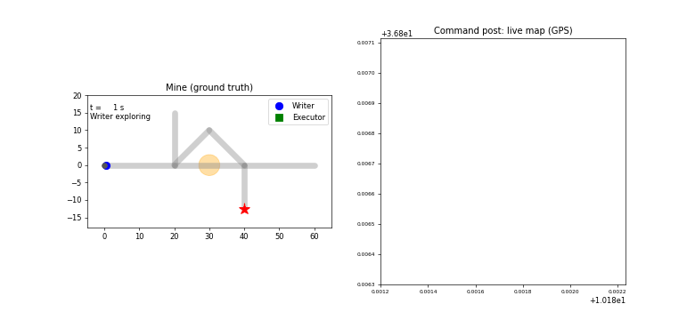
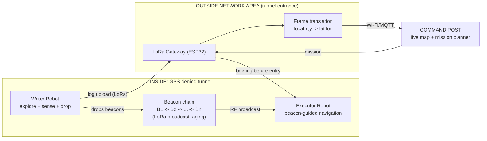

# The Living Map: Spatial Memory for Emergency Robots

TSYP14 Technical Challenge (IEEE RAS x IEEE AESS, Tunisia Section Chapters)

A two-robot system that gives an unmapped, GPS-denied space its own memory. A **Writer** robot explores a tunnel and leaves small LoRa **beacons** that store what it found. An **Executor** robot later follows the beacons to finish the mission, without starting from zero.

> Status: Phase 1 (initial phase) submitted.



## Chosen scenario

- **Environment:** Mines / Tunnels
- **Event types:** hazardous gas, victim detected
- **Radio:** LoRa (868 MHz, 433 MHz fallback; legal band for Tunisia still to be confirmed)
- **Outside Network Area:** ESP32 + LoRa gateway at the tunnel entrance, forwarding over Wi-Fi/MQTT (satellite in a real deployment)

## System chain

Writer explores -> events detected and beacons deposited -> Outside Network Area receives and translates -> wireless/satellite link -> Command Post -> Executor briefed -> Executor navigates using beacons.

## Architecture



Rule: no direct link between any robot and the command post. Everything passes through the Outside Network Area.

## Quick start (simulation)

Requires Python 3.10+.

```
py -m pip install -r requirements.txt
py -m pytest                                   # 31 tests
py run_demo.py                                 # live window
py run_demo.py --gif demo/demo.gif --no-show   # save the animation
```

Seed 7 result: 13 beacons dropped, Writer drift 1.38 m after about 250 m, the command post routes around the gas plume, and the Executor, deployed 15 minutes later, reaches the victim beacon with 0 gas exposure and 10 % of radio frames lost.

## Repository layout

| Path | Content |
|---|---|
| `livingmap/beacon.py` | Beacon, LOG and MISSION frames, aging law (same layout as the firmware) |
| `livingmap/frames.py` | Local frame <-> GPS translation |
| `livingmap/sim.py` | End-to-end simulation: world, Writer, gateway, command post, Executor, animation |
| `run_demo.py` | Command-line entry point for the simulation |
| `tests/` | pytest suite (packets, frames, simulation) |
| `docs/` | Architecture, data flow, packet design, frame translation, failure cases, plan, report |
| `demo/` | Simulation recording |
| `firmware/` | ESP32 + SX1276 firmware (PlatformIO), Phase 2 prototype in progress |

## Team

- Team **Winek?**: software lead + embedded lead

## License

MIT
