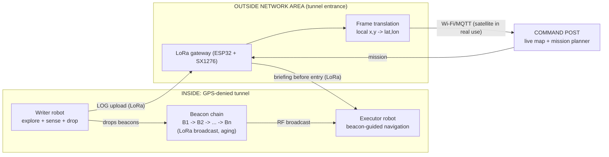

# System architecture

Rule: no direct link between any robot and the command post. Everything passes through the Outside Network Area.
The simulation bus raises `PermissionError` if a robot tries to talk to the command post directly.

## Zones
- **Inside (tunnel):** Writer, beacon chain, Executor. No GPS, no network.
- **Outside Network Area (ONA):** ESP32 + LoRa gateway at the entrance. Receives, translates to GPS, forwards.
- **Command post:** laptop with live map and mission planner.

## Component responsibilities
| Component | Responsibility | Tech (proposed) |
|---|---|---|
| Writer | Autonomous exploration, sensing, beacon deployment | ESP32, encoders, IMU, ultrasonic/lidar, gas sensor, PIR/thermal |
| Beacon | Store and broadcast one packet, age it | MCU + LoRa SX1276, battery |
| ONA gateway | Receive, translate, forward, brief | ESP32 + LoRa, Wi-Fi/MQTT |
| Command post | Live map, mission definition | Python + web map |
| Executor | Receive mission, follow beacons, avoid hazards | Same chassis family as Writer, LoRa receiver |

## Key design decisions
1. Memory lives in the beacons, not in the Writer.
2. The gateway does frame translation, robots only use their private frame.
3. Beacons are dumb broadcasters and do not relay to each other.
