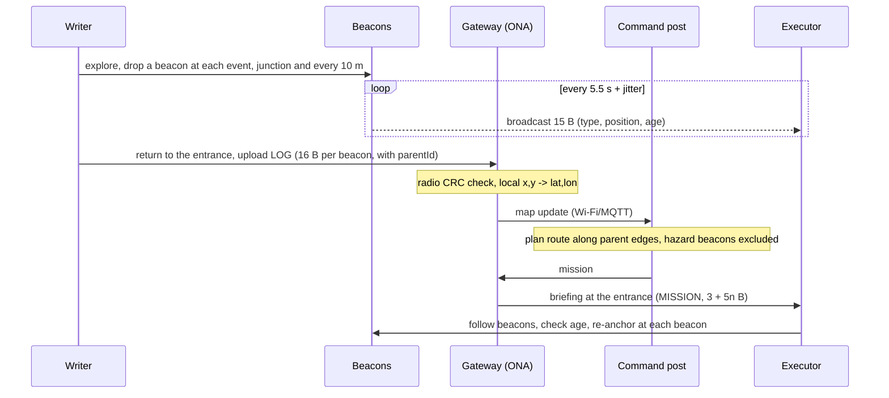

# End-to-end data flow

```mermaid
sequenceDiagram
  participant W as Writer
  participant B as Beacons
  participant G as Gateway (ONA)
  participant C as Command post
  participant E as Executor
  W->>B: explore, drop a beacon at each event, junction and every 10 m
  loop every 5.5 s + jitter
    B-->>E: broadcast 15 B (type, position, age)
  end
  W->>G: return to the entrance, upload LOG (16 B per beacon, with parentId)
  Note over G: radio CRC check, local x,y -> lat,lon
  G->>C: map update (Wi-Fi/MQTT)
  Note over C: plan route along parent edges, hazard beacons excluded
  C->>G: mission
  G->>E: briefing at the entrance (MISSION, 3 + 5n B)
  E->>B: follow beacons, check age, re-anchor at each beacon
```

Nothing goes directly between a robot and the command post: every message passes through the gateway.
